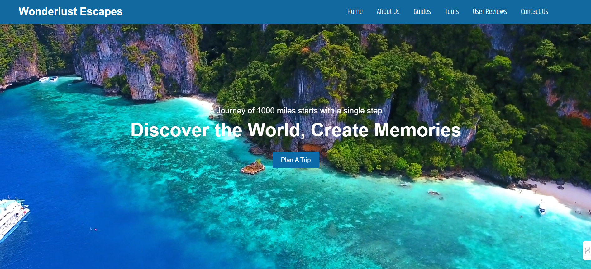
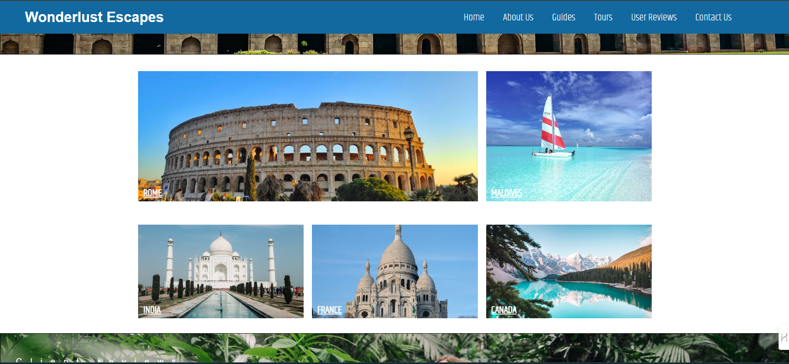

# 🌍 Wanderlust Escapes

Wanderlust Escapes is a travel website designed to inspire and guide travelers on their next adventure. Built using just HTML and CSS, this project showcases my web development skills in creating a visually appealing and responsive design.

## ✨ Features

- 🖼️ **Beautiful Design:** A clean and aesthetically pleasing layout that captures the essence of travel.
- 📱 **Responsive Layout:** The site adapts seamlessly to different screen sizes, ensuring a great user experience on both desktop and mobile devices.
- 🗺️ **Travel Inspiration:** A collection of stunning travel destinations to inspire wanderlust.

## 🛠️ Technologies Used

- 🎨 **Frontend:** HTML, CSS

## 📸 Screenshots

